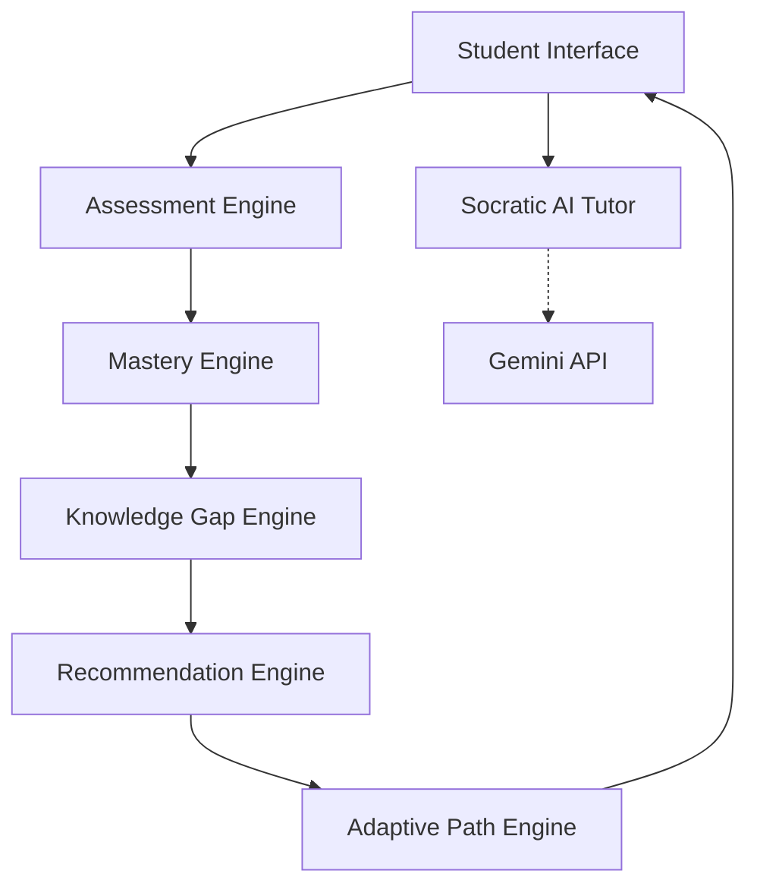

# EduAdapt Architecture

The system is separated into three major conceptual layers:

## 1. Student / Teacher Interfaces (Next.js)
The presentation layer provides distinct, purpose-built interfaces. The Student Dashboard is action-oriented, the Knowledge Map is built for visual exploration, and the Learning Session is distraction-free.

## 2. Learning Engine (Express & MongoDB)
This is the deterministic core of EduAdapt.
- **Assessment Engine**: Handles quiz logic and scoring.
- **Mastery Engine**: Consolidates assessment data, recent performance, and consistency into a Mastery Score (UNKNOWN, WEAK, DEVELOPING, MASTERED).
- **Knowledge Gap Engine**: Tracks exact misconception tags.
- **Adaptive Path Engine**: Uses a Prerequisite Graph to lock/unlock topics and compute the Next Best Learning Action with explainable reasons.

## 3. AI Layer (Gemini)
The AI layer enhances the learning engine but does not replace it. It provides the **Socratic Tutor**, generating hints and explaining misconceptions contextually without hallucinating learning paths.

